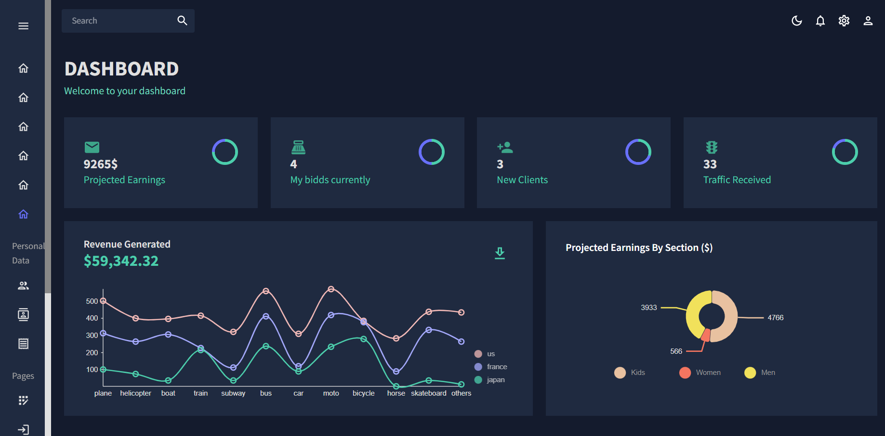
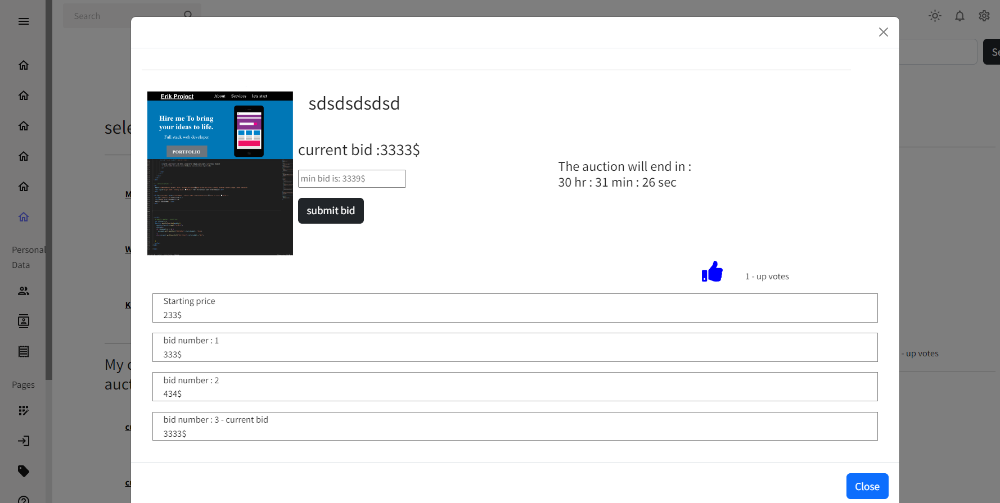

## About the project
auction.co.il is a full-stack auction platform that 
lets you post items for sale and bid on other listed items.

## Running the project

1. Clone the repo.
2. Run `npm install`.
3. enter the server folder.
4. run `nodemon server.js`.
5. go back to the root folder.
6. Run `npm start`.
7. Navigate to `http://localhost:3000`.

## Technologies:

### Client-side:
* React.JS
* mui
* nivo charts

### Server-side:
* Node.JS
* Express
* MongoDb

## What's next:
1. improve overall user interface.
3. add more item categories. 
3. add user section.
4. Move the function handling the end of the auction to the server-side.

 Dark mode dashBoard with real time data

 Light mode

Item bids section

